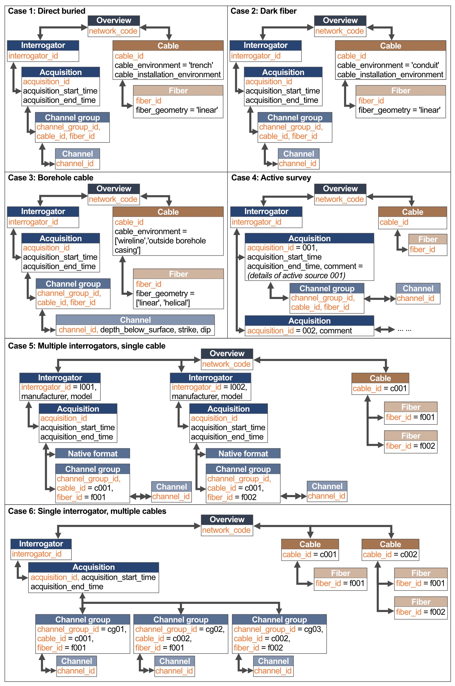

## Distributed Acoustic Sensing Metadata Standard (v1.1.0)   Example Scenarios 

Following the reusability principle under FAIR, the metadata standard (v1.1.0) is designed to be sufficiently described to allow a non-participant to understand the experiment setup and the information on the collected data obtained independently from data servers. Here are examples of the metadata standard applied to four common scenarios (horizontal direct buried cable, dark fiber, borehole cable, and active survey) and two hypothetical scenarios, and showed that the metadata standard can record the key differences across these increasingly complicated scenarios.

* **Case 1: Direct buried cable**\
For a simple experiment set up with one interrogator connected to a cable buried in a horizontal trench, the metadata structure is relatively straight forward, with a single parent Interrogator metadata and a single parent Cable metadata. Within the Cable metadata, the user will set ‘*cable_environment*’ as ‘trench’, which is part of the controlled vocabulary list, and can further describe in plain language under ‘cable_installation_environment’. ‘*Fiber_geometry*’ under the Fiber metadata will be defined as ‘linear’. If there are multiple acquisitions at different times along the same cable (and fiber), the metadata schema allows additional Acquisition metadata blocks associated with independent Channel Group metadata mapped to the Cable and Fiber metadata by specifying the cable_id and fiber_id.

* **Case 2: Dark fiber cable**\
For a dark fiber cable, the metadata will be similar to the case of direct buried cable, with the distinction made for ‘*cable_environment*’ where the user may define as ‘conduit’. For occasions where certain channels have to be omitted, the user can define the ‘*first_usable_channel_id*’ and ‘*last_usable_channel_id*’. 

* **Case 3: Borehole cable**\
For a downhole experiment with one interrogator connected to a borehole cable, a user would specify ‘*cable_environment*’ under cable metadata as either ‘outside borehole casing’ or ‘wireline’, and under fiber metadata, ‘*fiber_geometry*’ as ‘linear’ or ‘helical’. Under the individual channel metadata, ‘*depth_below_surface*’, ‘*strike*’, and ‘*dip*’ can be defined. The uncertainties for these measurements are common to all channels and will be defined under the Channel Group metadata. 

* **Case 4: Active survey**\
For active source surveys along DAS deployment, the metadata structure is similar to the cases of using direct buried, dark fiber, and borehole cables. A user can opt for a single Acquisition metadata for the entire survey duration if there are no changes to the acquisition settings. Although the acquisition is primarily for the photonics setup, a user could still record details of the active source through a simple workaround by utilizing the comment attribute in the Acquisition metadata. Each new active source would then have its own unique Acquisition metadata. 

* **Case 5: Experiment involving multiple interrogators and a single cable**\
A hypothetical scenario which may involve multiple acquisitions is during instruments- benchmarking where several interrogators are connected to the same cable (but different fibers) and several acquisition settings are tested. The metadata schema allows the description of each interrogator with their respective acquisition settings. As for the time series data, despite sharing the same time stamp, each time series can still be mapped to their respective metadata through a sequence of unique identifiers from the interrogator, acquisition, and fiber (see Section 4.1).

* **Case 6: Experiment involving a single interrogator and multiple cables (and fibers)**\
While most commercial interrogators employ a simple one-to-one setup (i.e., one interrogator to one fiber), interrogators may use an optical switch to utilize two fibers from two different cables within the same acquisition. In this case, the cable and fiber information are recorded under distinct Fiber metadata blocks nested within their respective Cable metadata blocks. The interrogator information will contain a single Interrogator metadata with one Acquisition metadata but several Channel Group metadata blocks with unique *channel_group_id*s and *fiber_id*s to identify the fiber used.

