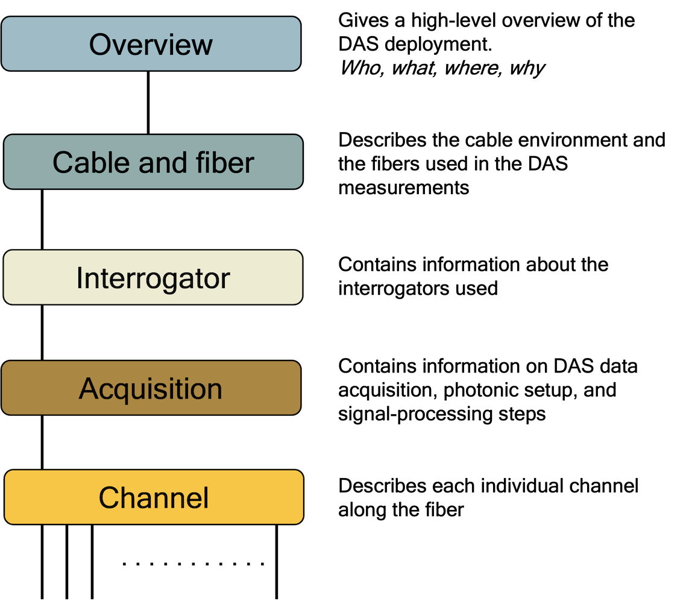

# Distributed Acoustic Sensing Metadata Guide

Proposed guidelines for standardizing DAS metadata for archival purposes and to guide data collection at experiments. The intent is that this metadata data standard should be independent of the specific implementation and the emphasis is on content. We provide a suggested outline for content and show examples for several case studies.

In addition, we distinguish between required and recommended metadata.  Required metadata is information that is considered essential to enable re-use of the data. This information makes the data self-describing and no further information required from the provider to work with the data. Optional metadata is information that could be useful in interpreting the measured signal but is not essential. For example, gauge length is required metadata while the geographic coordinates of tap tests used to provide gauge positions is recommended.

We seek any additional feedback, with the goal of making DAS products **F**indable, **A**ccessible, **I**nteroperable, and **R**eusable (FAIR).

---

The proposed metadata is divided into five major blocks: [overview](term_overview.md), [cable and fiber](term_cable_and_fiber.md), [interrogator](term_interrogator.md), [acquisition](term_acquisition.md), and [channel](term_channel.md).

