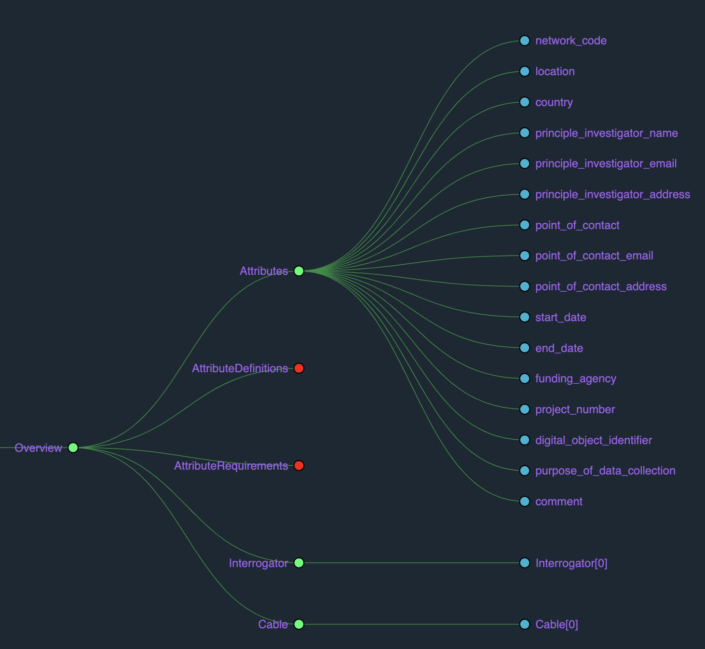

# Distributed Acoustic Sensing Metadata Standard (v1.1.0) template

We recommend using the open-source format such as JavaScript Object Notation (JSON) for the metadata standard for its accessibility. JSON can be read with widely available libraries across multiple coding platforms (e.g., the json module in python). Once imported, the metadata can be exported to formats such as XML or even as a flat ASCII delimited file. This versatility would encourage interoperability, from generating the metadata during deployment to post-processing, analysis, and long-term storage. 

Here is an example of the [metadata schema in JSON format](example_poro.json), which can be visualized using many open-access software (e.g., JSON Viewer Pro ([link](https://chrome.google.com/webstore/detail/json-viewer-pro/eifflpmocdbdmepbjaopkkhbfmdgijcc)))

