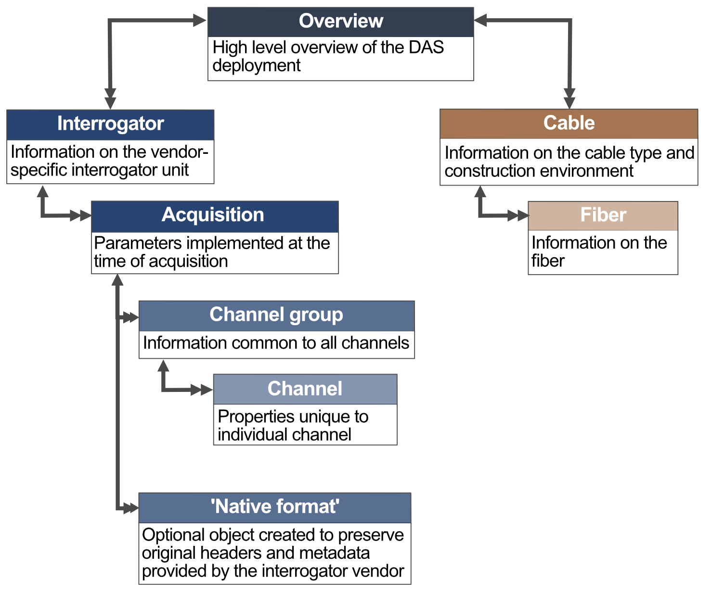

# Distributed Acoustic Sensing Metadata Schema (v1.1.0)

The metadata fully describes the five key components of a DAS data collection system: (1) interrogator, (2) data acquisition, (3) channels, (4) cable, and (5) fiber. The metadata schema is hierarchical based, with a parent ‘overview’ metadata block describing the experiment, and two main child branches describing the instrument (i.e., interrogator, photonics setup, acquisition parameters) and the sensor locations (i.e., cable installation and fiber properties). The simplest example is one fiber within one cable connected to one interrogator. The suggested metadata structure allows for much more complex installations with multiple fibers, cables, and interrogators deployed with different acquisition parameters. The metadata schema is designed to be independent of the time-series data so that corrections and updates can be applied to the metadata, without having to manipulate large volumes of time-series data.

Each metadata block consists of required and optional attributes. Required metadata is information that is considered essential to enable re-use of the data. This information makes the data self-describing and no further information required from the provider to work with the data. Optional metadata is information that could be useful in interpreting the measured signal but is not essential.

---

The proposed metadata is divided into six major blocks: [overview](./overview.md), [interrogator](./interrogator.md), [acquisition](./acquisition.md), [channel group](./channelgroup.md) (and individual [channel](./channel.md)), [cable](./cable.md), and [fiber](./fiber.md). 

